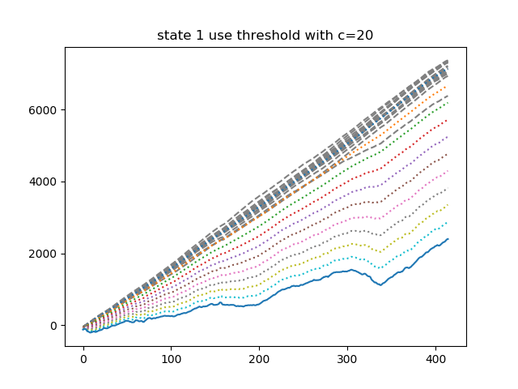

# birl HMM Repository
---

# Purpose Of This Repository
This repository deals with data published by [topic_multimodal node](https://github.com/birlrobotics/birl_baxter_tasks/blob/master/scripts/real_task_common/real_topic_multimodal.py) which resides in [birl_baxter_tasks repository](https://github.com/birlrobotics/birl_baxter_tasks).

The data we're dealing with contain robot endpoint pose, wrench, endpoint twist. We want to analyse those data that are from successful trials, and in the test phase, to detect anomalies in arriving data. This repository serves this purpose.

For the details of our method, have a look at this [paper(link to be updated)]().


# How To Run These Codes
## To Train HMM Model

1. install dependencies
   - [hmmlearn](https://github.com/hmmlearn/hmmlearn) 
   - [hongminhmmpkg(link to be updated)]()
   
1. download our [dataset repository](https://github.com/sklaw/baxter_pick_and_place_data)

1. tune configuration in ./hmm_for_baxter_using_only_success_trials/training_config.py. 
    
    usually, we only need to modify the __config_by_user__ variable. The fields of this variable we need to modify are:
    - bath_path: set this path to be the folder path of the dataset which you want to use. E.g.:
    ```
    path_to_dataset_repository/REAL_BAXTER_PICK_N_PLACE_with_5_states_20170714
    ```

1. run the following commands:

    ```
    cd hmm_for_baxter_using_only_success_trials
    python birl_hmm_user_interface.py --train-model --train-threshold
    ```
    
    these two commands will train the HMM model and train the threshold which is used in anomaly detection.
    
1. check the dataset folder, you will find 2 folders named __model__ and __figure__. __model__ stores the models trained with the dataset. __figure__ stores some plots that help us assess the models.
     
## HOWTO

### To implement the skill identification using different metircs (Cumulative log-likelihood (or LL for short), log-likelihood, Gradient of log-likelihood)
First chect to the plot_3_metrics_in_one_plot branch
```
git checkout plot_3_metrics_in_one_plot
```
path to the hmm_for_baxter_using_only_success_trials directory
```
cd ./HMM/hmm_for_baxter_using_only_success_trials/
```
check the selected method (HMM or HDPHMM) and selected modalities
```
emacs training_config.py 
```
train the probabilistic model for each skill/state/phase/sub-task
```
python birl_hmm_user_interface.py --train-model
```
run the testing script to get the plot
```
python experiment_runner.py --test-if-gradient-can-detect-state-switch
```
test_if_gradient_can_detect_state_switch.png


### TO RUN plot_skill_identification_and_anomaly_detection
First learn the threshold of log-likelihood
```
python birl_hmm_user_interface.py --learn_threshold_for_log_likelihood
```
e.g 


and/or learn the threshold for graient of log likelihood
```
python birl_hmm_user_interface.py --learn_threshold_for_gradient_of_log_likelihood
```
e.g.


and/or learn the threshold for derivative of difference of log-likelihood
```
python birl_hmm_user_interface.py --learn_threshold_for_deri_of_diff
```
e.g.


plot all the log-likelihood curves of state
```
python birl_hmm_user_interface.py --trial-log-likelihood-plot
```
e.g.


Finally, run skill identification and anomaly detection
```
python birl_hmm_user_interface.py --plot_skill_identification_and_anomaly_detection --trial_class success
```
e.g.

  
### To Run HMM Online Service

Remember that our goal is to provide anomaly detection service for robot task execution. run the following command to bring up this service:

```
python birl_hmm_user_interface.py --online-service
```
